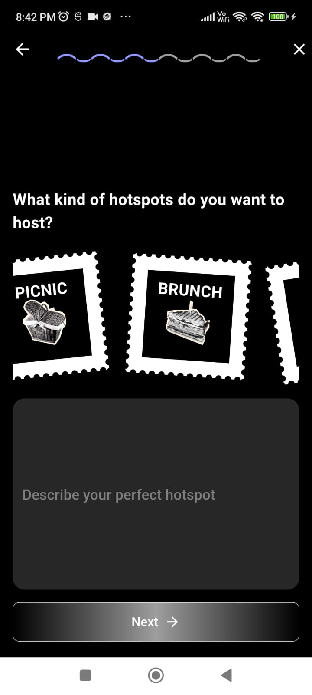
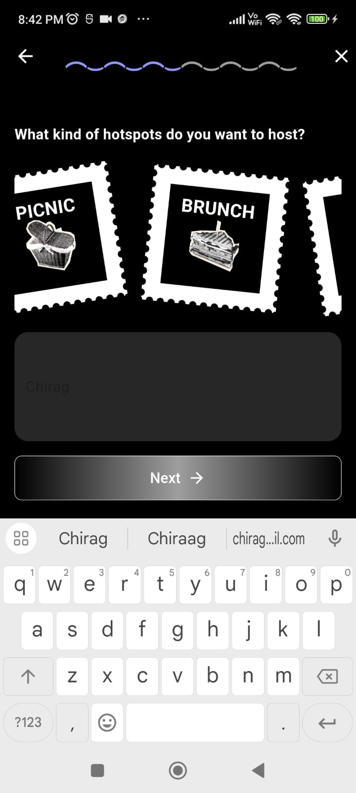
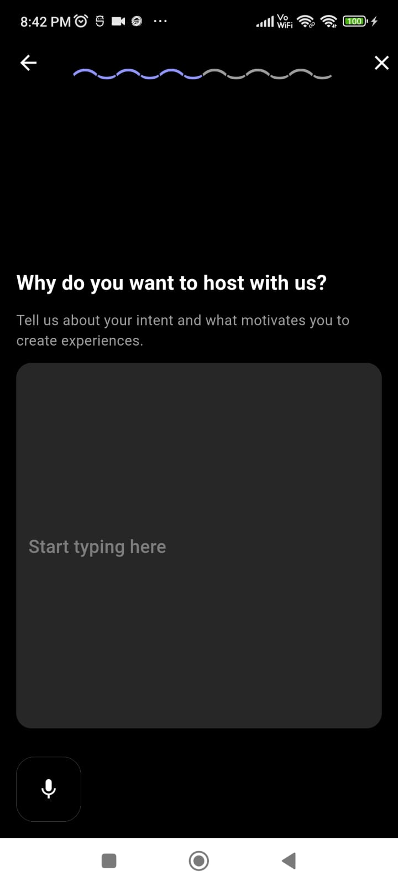
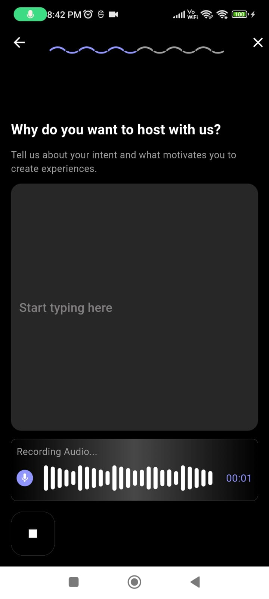
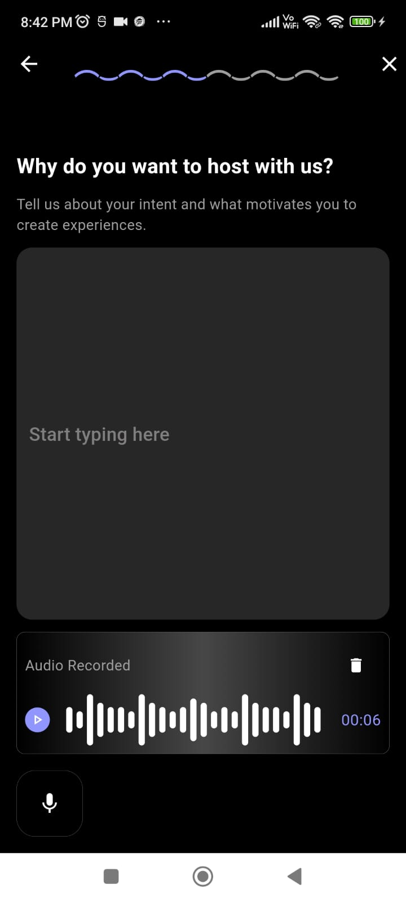

# 8Club App

This Flutter app allows users to select and deselect the hotspots and record audio and type text simultaneously. The app features a custom recording interface with a dynamic wave visualization that appears during and after recording. The text input adjusts in size based on the keyboard's visibility.

## Features

- **Select and Deselect**: User can select and deselect multiple hubspots.
- **Audio Recording**: Start and stop audio recording with a single button.
- **Waveform Visualization**: A real-time audio waveform visualizes the recording in progress and after completion.
- **Dynamic Text Field**: The text field adapts its size when the keyboard is opened or closed, offering an optimized user experience.
- **File Storage**: Recorded audio files are saved locally with unique filenames in `.wav` format.
- **Permission Handling**: Microphone permissions are requested before recording starts.

## Screenshots

Here are some screenshots and Recording of the app in action:

[Watch Recording Demo](https://drive.google.com/file/d/1hkSkivM9AFXOMkfrrFr5nSKuDtn06itq/view?usp=sharing)







## Getting Started

To get started with this project, follow these steps:

### Prerequisites

Make sure you have the following installed:

- [Flutter SDK](https://flutter.dev/docs/get-started/install)
- Android Studio or Visual Studio Code
- Git

### Clone the Repository

To clone this repository and get started with the project:

```bash
git clone https://github.com/CHIRAG137/8club_assignment_frontend
```

### Note
Tried completing max of the UI but due to time constraints could complete this much and I have implemented the bloc architecture in some of the files so that you can understand my knowledge of bloc but due to less time could not use bloc everywhere.
